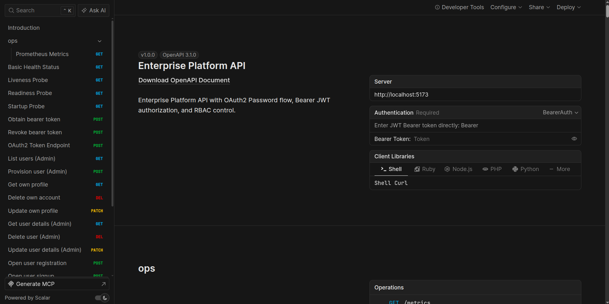

# Backend Service

High-performance ASGI API built with Litestar 2.x, SQLAlchemy 2.0, TimescaleDB, and Valkey.

<p align="center">
  
</p>

---

## Internal Structure

The backend is organized according to clean modular architecture principles:

```text
src/app/
├── core/           # Configuration, rate limiting, OpenAPI plugins, security, exception handling
├── domain/         # Clean architecture domain models, schemas, and business services
├── adapters/       # Cache, database session factories, transactional outbox, external integrations
└── presentation/   # Litestar API route controllers, guards, and middleware
```

### Module Responsibilities

* **`core/`**: Application configuration, logging formatters, JWT token security, multi-engine OpenAPI documentation plugins (Scalar, Swagger UI, ReDoc, Stoplight Elements, RapiDoc), and atomic Valkey sliding-window rate limiters.
* **`domain/`**: Entity models (User, Items, Telemetry, Audit Logs), business validation schemas (msgspec/Pydantic), and domain service contracts.
* **`adapters/`**: Database engine setup (SQLAlchemy 2.0 async engine + PgBouncer compatibility), Valkey caching layer, SAQ worker queue adapters, and TimescaleDB hypertable audit CDC listeners.
* **`presentation/`**: Controller endpoints (`/api/v1/auth`, `/api/v1/users`, `/api/v1/telemetry`, `/health`), authentication guards, and request lifecycle hooks.

---

## Database & Migrations Guide

The application utilizes **PostgreSQL 16** with **TimescaleDB** extensions and **PgBouncer** connection pooling. Database migrations are managed via **Alembic**.

### Creating Migrations

To generate a new auto-detected migration after modifying SQLAlchemy models:

```bash
# Create a new migration revision inside the container
make exec-db CMD="alembic revision --autogenerate -m 'add_entity_table'"
```

### Applying Migrations

To run all pending migrations up to the `head` revision and seed initial administrator credentials:

```bash
# Apply pending schema migrations
make migrate
```

### Manual Rollback & Downgrade

```bash
# Downgrade one revision step
make exec-db CMD="alembic downgrade -1"
```

---

## OpenAPI Schema Export & Client Generation

The backend provides a deterministic schema export utility:

* **Export Script:** [`scripts/export_schemas.py`](file:///home/pat/Business/LiteStar/backend/scripts/export_schemas.py) instantiates the Litestar application in headless mode, exports the OpenAPI 3.1 specification, and formats the output JSON deterministically (`sort_keys=True`, 2-space indentation).
* **Execution:**
  ```bash
  # Export schema and synchronize frontend TypeScript SDK
  make frontend-sync
  ```

---

## Testing & Quality Assurance

All linters and test suites execute within the container environment to ensure zero host environment discrepancy:

```bash
# Run Ruff linting and formatting checks
make lint

# Run Pytest suite with async event loop verification (80+ unit and integration tests)
make test

# Run full QA gate (lint + test + schema drift check + build)
make check
```

---

## Key Resilience & Performance Features

1. **Granian ASGI Server:** Powered by Rust-based Granian with 4 worker processes and non-blocking asynchronous I/O.
2. **PgBouncer Multiplexing:** Transaction-level connection pooling eliminating PostgreSQL backend process exhaustion.
3. **Sliding-Window Rate Limiting:** High-frequency rate limiting implemented directly via atomic Valkey Lua scripts.
4. **Resilient Background Tasks:** Asynchronous task processing with automated retries and dead-letter queues via [SAQ](https://github.com/tobymao/saq).
5. **Row-Level Security (RLS):** Automated transaction-scoped PostgreSQL session context (`app.current_user_id`, `app.current_tenant_id`) enforcing clean isolation.
