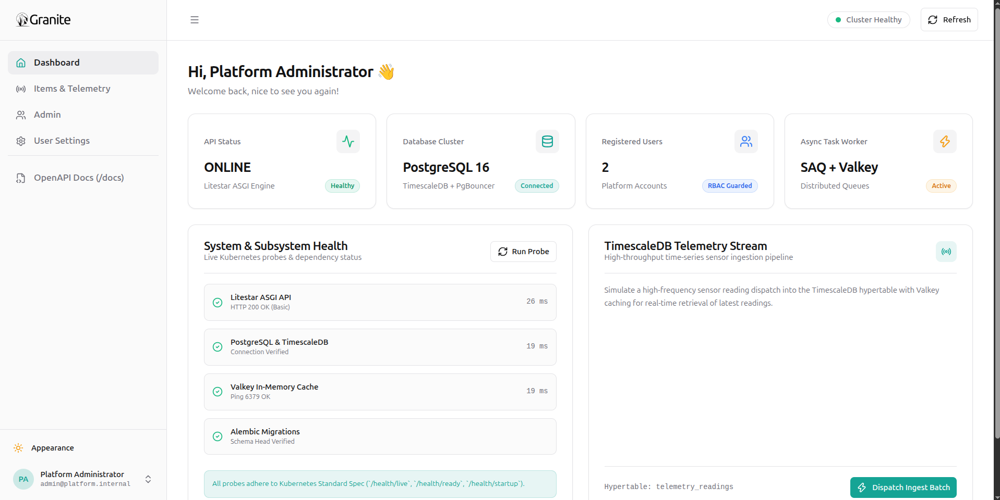
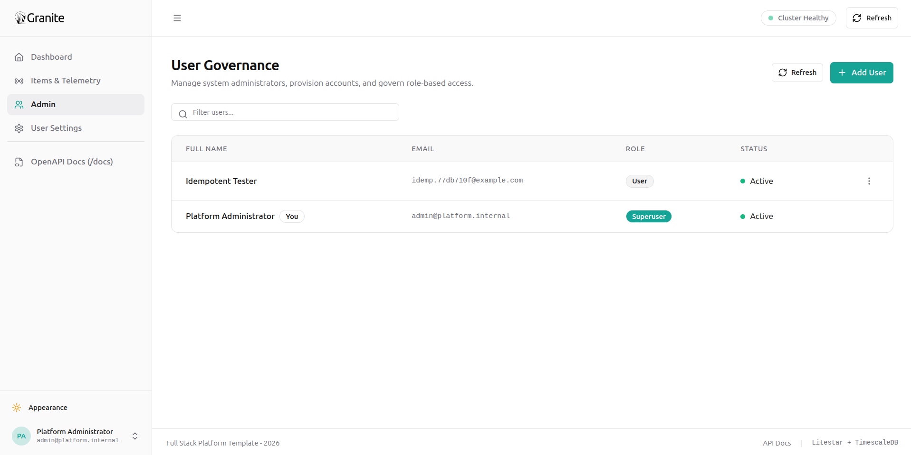

# Frontend Application

<p align="center">
  
</p>

Single Page Application built on React 18, Vite, TypeScript, and Tailwind CSS.

---

## Visual Tour

<p align="center">
  
  
</p>

---

## Design Tokens & Theme System

The user interface implements 1:1 visual parity with the official FastAPI Full-Stack Template design system:

### Color Palette & Tokens

* **Primary Teal Token:**
  * **Light Mode:** `hsl(174, 85%, 35%)`
  * **Dark Mode:** `hsl(174, 85%, 42%)`
* **Destructive / Error Token:**
  * `hsl(0, 84%, 60%)` / `rgb(239, 68, 68)`
* **Surface Tokens:**
  * `bg-background`, `bg-card`, `bg-popover`, `bg-muted`, `border-border`

### Theme Switching (`useTheme`)

Themes are persisted in `localStorage` and managed reactively via [`hooks/useTheme.tsx`](file:///home/pat/Business/LiteStar/frontend/src/hooks/useTheme.tsx), applying the `.dark` CSS class to the root document element.

### Reactive Error Styling & Form Validation

* **Sharp Error Outlines:** Failing input validation transitions the border to `border-destructive` with an active `focus-visible:ring-destructive/20` focus ring.
* **Inline Error Microcopy:** Clear, left-aligned error messages (`text-xs text-destructive font-normal mt-1`) rendered directly under the invalid field.
* **Reactive Clearing:** Error borders and helper messages clear immediately as the user edits the input.
* **Accessible Semantics:** Form controls receive `aria-invalid="true"` and `aria-describedby="{id}-error"` when invalid.

---

## Client SDK Generation Workflow

The frontend features an automated OpenAPI-to-TypeScript SDK generation pipeline powered by `@hey-api/openapi-ts`:

```bash
# 1. Export latest OpenAPI schema from backend and regenerate typed TypeScript client
make frontend-sync

# 2. Run TypeScript compilation check and create production build
make frontend-build
```

### Generated Client Usage Example

```typescript
import { apiV1UsersListUsers } from "@/client/sdk.gen";

// Fully typed asynchronous request with type completion
const response = await apiV1UsersListUsers({
  query: { skip: 0, limit: 100 },
});

console.log(response.data?.data);
```

---

## Component Architecture

```text
src/
├── client/         # Auto-generated @hey-api TypeScript fetch client & types
├── components/
│   ├── common/     # AuthLayout, Logo, Appearance, Footer, ErrorBoundary
│   ├── layout/     # AppShell, Sidebar, Header
│   └── ui/         # Button, Input, PasswordInput, Modal, Toast, Alert, Badge, Card
├── features/
│   ├── auth/       # LoginForm, auth validation mechanics
│   ├── dashboard/  # MetricsOverviewCards, SystemHealthCard, TelemetryStream
│   └── users/      # UsersDataTable, AddUser, EditUser, DeleteUser, UserActionsMenu
├── hooks/          # useAuth, useTheme, useCustomToast
└── pages/          # LoginPage, DashboardPage, UsersPage, SettingsPage
```

---

## Developer Commands

| Command | Action |
| --- | --- |
| `make frontend-sync` | Synchronize backend OpenAPI contract with `@hey-api` client. |
| `make frontend-build` | Verify TypeScript compilation (`tsc`) and build Vite bundle (`dist/`). |
| `make check` | Execute end-to-end linting, schema zero-drift validation, and tests. |
